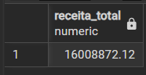
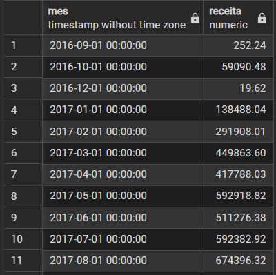
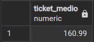
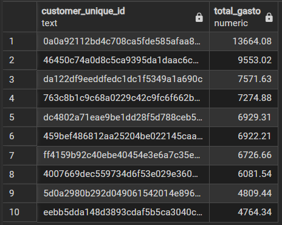
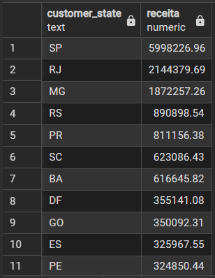

# 🛒 Análise de Dados de E-commerce com SQL

## 📌 Objetivo

Analisar dados de um e-commerce para identificar padrões de faturamento, comportamento de clientes e distribuição de receita utilizando SQL.

---

## 📊 Base de Dados

O dataset contém informações sobre:

* Pedidos
* Pagamentos
* Clientes
* Localização (estado)
* Datas de compra

Simulando um cenário real de análise comercial.

---

## ❓ Perguntas de Negócio

* Qual é a receita total do e-commerce?
* Como a receita evolui ao longo do tempo?
* Qual é o ticket médio por pedido?
* Quem são os clientes que mais geram receita?
* Como a receita está distribuída geograficamente?

---

# 📊 Análises e Resultados

---

## 💰 Receita Total



A receita total do e-commerce ultrapassa **R$ 16 milhões**, demonstrando um alto volume de transações.

### 🔍 Query

```sql
SELECT ROUND(SUM(payment_value), 2) AS receita_total
FROM payments;
```

### 🧠 Insight

O alto faturamento indica uma operação consolidada, permitindo análises estratégicas mais aprofundadas.

---

## 📅 Receita por Mês



Evolução da receita ao longo do tempo.

### 🔍 Query

```sql
SELECT 
    DATE_TRUNC('month', o.order_purchase_timestamp) AS mes,
    ROUND(SUM(p.payment_value), 2) AS receita
FROM orders o
JOIN payments p ON o.order_id = p.order_id
GROUP BY mes
ORDER BY mes;
```

### 🧠 Insight

A receita apresenta variações ao longo do tempo, indicando **possível sazonalidade** e picos de vendas em períodos específicos.

---

## 🎯 Ticket Médio



Valor médio gasto por pedido.

### 🔍 Query

```sql
SELECT 
    ROUND(SUM(payment_value) / COUNT(DISTINCT order_id), 2) AS ticket_medio
FROM payments;
```

### 🧠 Insight

O ticket médio permite entender o comportamento de consumo dos clientes e identificar oportunidades de aumento de receita por pedido.

---

## 👥 Top 10 Clientes



Clientes com maior volume de compras.

### 🔍 Query

```sql
SELECT 
    c.customer_unique_id,
    ROUND(SUM(p.payment_value), 2) AS total_gasto
FROM customers c
JOIN orders o ON c.customer_id = o.customer_id
JOIN payments p ON o.order_id = p.order_id
GROUP BY c.customer_unique_id
ORDER BY total_gasto DESC
LIMIT 10;
```

### 🧠 Insight

A receita está concentrada em um grupo reduzido de clientes, indicando a importância de estratégias de retenção para clientes de alto valor.

---

## 📍 Receita por Estado



Distribuição geográfica do faturamento.

### 🔍 Query

```sql
SELECT 
    c.customer_state,
    ROUND(SUM(p.payment_value), 2) AS receita
FROM customers c
JOIN orders o ON c.customer_id = o.customer_id
JOIN payments p ON o.order_id = p.order_id
GROUP BY c.customer_state
ORDER BY receita DESC;
```

### 🧠 Insight

A receita apresenta concentração em determinados estados, permitindo direcionamento estratégico de campanhas e logística.

---

# 🛠️ Tecnologias Utilizadas

* SQL (PostgreSQL)

---

# 📂 Como Executar

1. Importar os dados para o PostgreSQL
2. Executar as queries disponíveis no repositório
3. Analisar os resultados

---

# 🎯 Conclusão

Este projeto demonstra a aplicação de SQL para análise de dados de negócio, permitindo extrair insights relevantes sobre faturamento, comportamento de clientes e distribuição geográfica da receita.
